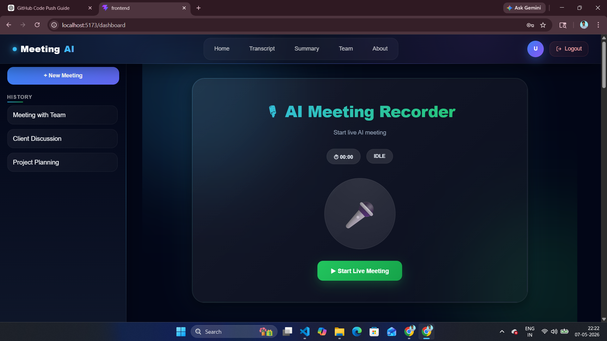
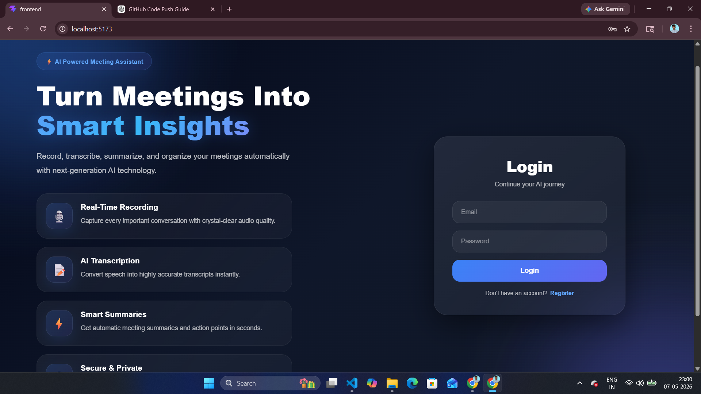
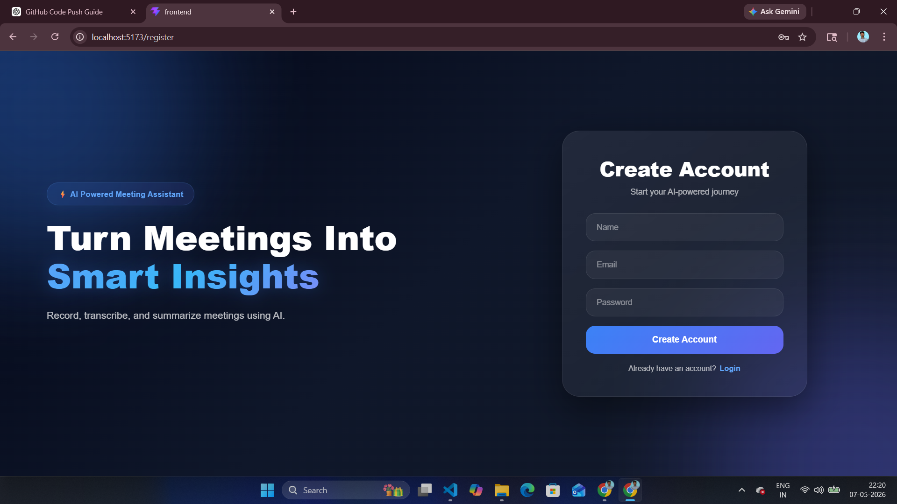
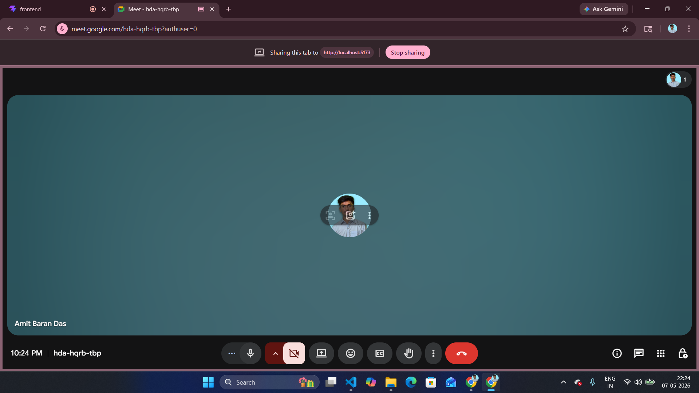
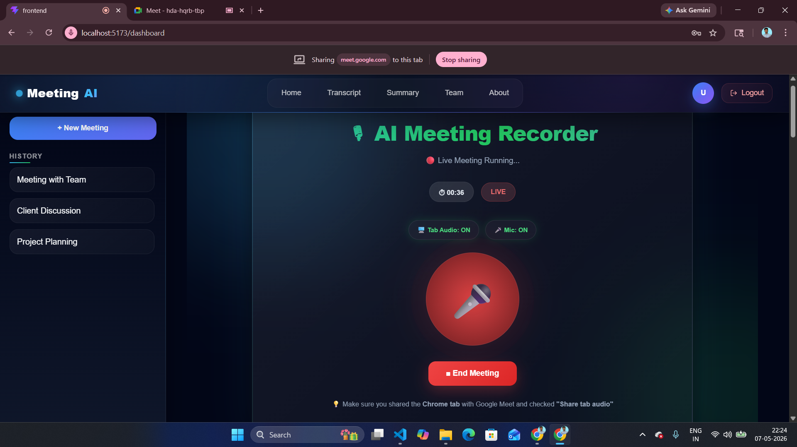
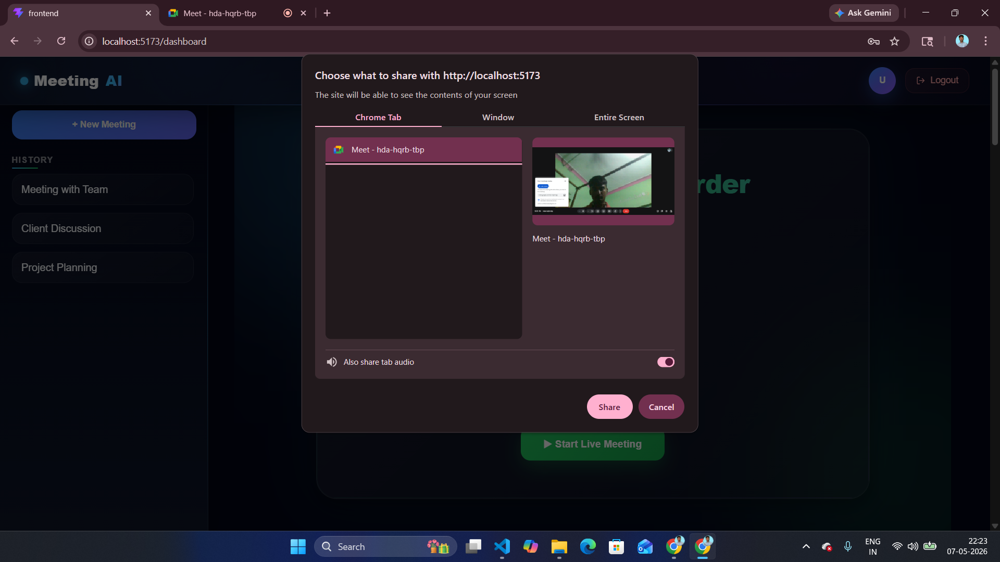
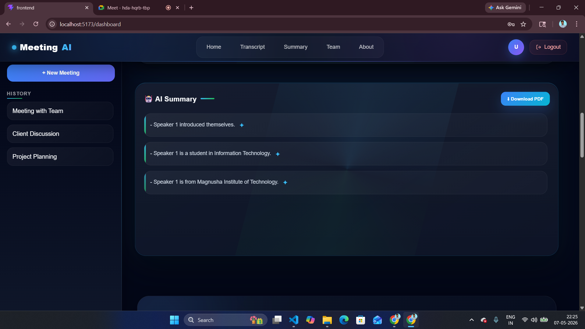
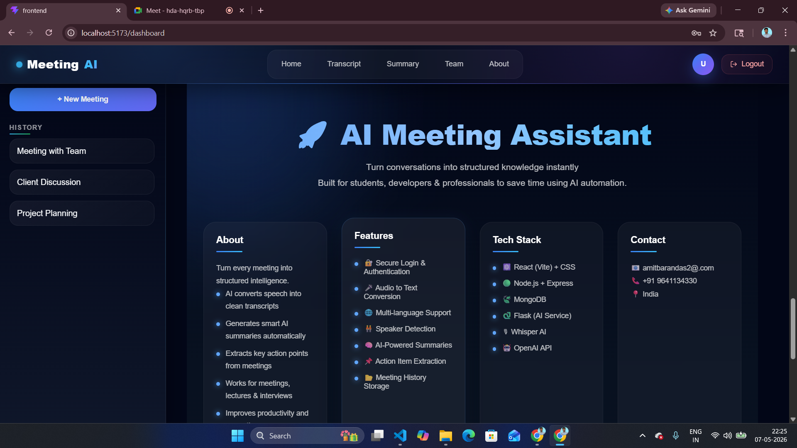
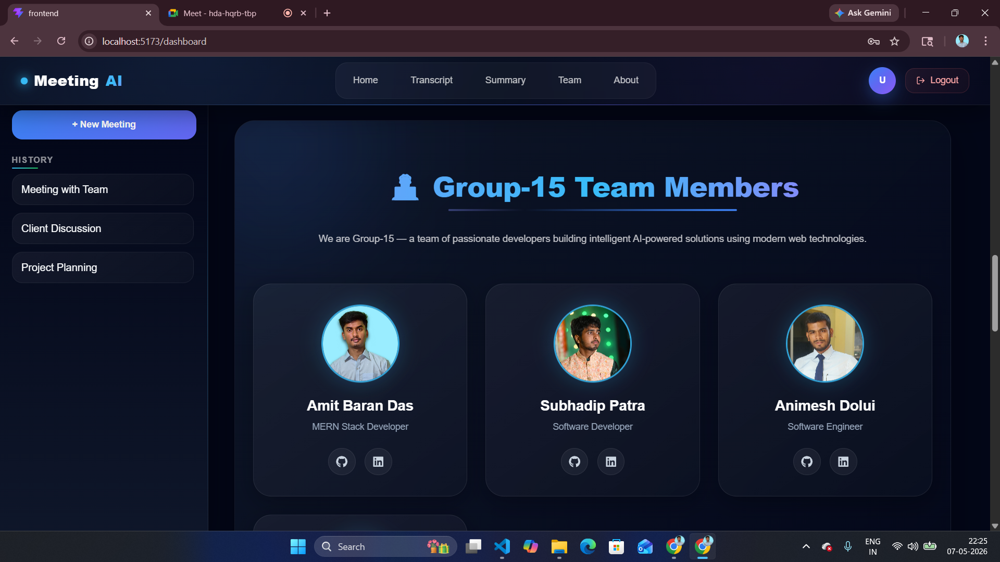

# AI Meeting Application

An AI-powered meeting platform that records meetings, generates live transcripts, translates speech, creates intelligent AI summaries, and exports summaries as PDF documents.

---

## Features

### AI-Powered Audio Processing

* Real-time meeting recording
* Speech-to-text transcription using Whisper API
* AI-generated meeting summaries using GPT API
* Translation support for multilingual meetings
* PDF export for meeting summaries

### Modern Frontend

* Responsive React + Vite UI
* Animated dashboard
* Transcript and summary panels
* Team member section
* Modern navbar and sidebar

### Backend & Database

* Node.js + Express backend
* MongoDB database integration
* Authentication system
* Socket.IO real-time communication

---

# Tech Stack

## Frontend

* React.js
* Vite
* CSS3
* Socket.IO Client

## Backend

* Node.js
* Express.js
* MongoDB
* Mongoose
* Socket.IO

## AI Service

* Flask
* Whisper API
* GPT API
* PDF Generation

---

# Screenshots

## Home Dashboard

## Login Page

## Register Page

## Running Meeting Tab

## Meeting Running

## Meeting Share

## Summary Panel

## Footer Section

## About Developer

Example:
* login
* Register
* Dashboard UI
* Recorder UI
* Transcript panel
* Summary panel

---

# Future Improvements

* Real-time transcription
* Team collaboration
* Cloud storage integration
* Meeting history dashboard
* AI action items generation
* Multi-language support

---

# Author

## Amit Baran Das

AI & Full Stack Developer

GitHub:
[https://github.com/amitdas-4330](https://github.com/amitdas-4330)

